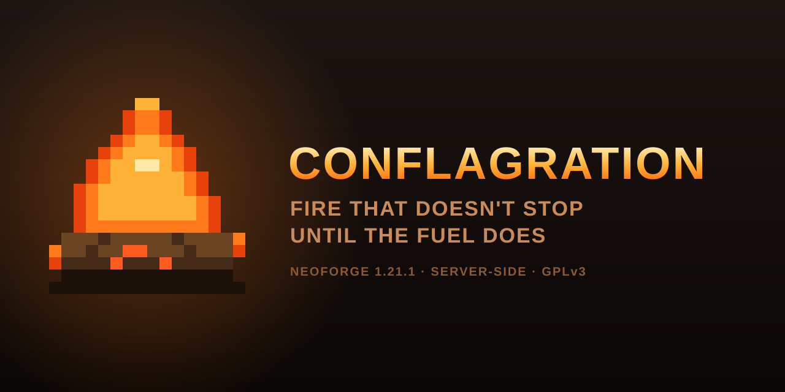

# Conflagration

Vanilla fire doesn't burn anything down. Light a village house and you get scorch marks and a
missing plank. Light a forest and the canopy flashes over in ten seconds while every single trunk
survives. Conflagration makes fire spread hard enough that buildings and forests actually come
down.

NeoForge server mod for Minecraft 1.21.1, by boredhero, [GPL-3.0-or-later](LICENSE).

## The two numbers

Every flammable block carries two independent values, and confusing them is why most attempts at
"make fire worse" end up making fires fizzle faster.

**Ignite** (Mojang calls it encouragement) is how readily a block catches from a fire next to it.
This is the value that makes fire *travel*.

**Burn** (flammability) is how fast the block is consumed once it's alight. Raise this too far and
your fires get *shorter*, because the fire eats the fuel it's standing on.

Stock values:

| Block | ignite | burn |
|---|---:|---:|
| Logs, wood | 5 | 5 |
| Planks, stairs, fences | 5 | 20 |
| Leaves, wool | 30 | 60 |
| Carpet, hay | 60 | 20 |

Logs at ignite 5 are the whole problem. Structural wood is near-fireproof on purpose so that
villages and player builds don't routinely burn down: a reasonable call for vanilla, a boring one
for a server that wants fire to mean something. Leaves catch easily and burn away fast, so the
canopy goes up in a flash and then the fire is standing on nothing.

Conflagration's rule is high ignite, moderate burn. Fire travels eagerly, but fuel sticks around
long enough for a house to actually collapse.

Two things people try before installing a mod, neither of which works:

- **There is no gamerule, datapack, tag or config in the game that touches flammability.** The
  table is a private `Object2IntMap` inside `FireBlock`, populated from Java at bootstrap. That is
  the entire reason this has to be a mod.
- **`randomTickSpeed` does nothing for fire.** Fire has run on scheduled ticks since 1.16
  ([MC-181868](https://bugs.mojang.com/browse/MC-181868)). Cranking it costs TPS and buys nothing.
  The advice is everywhere and it is wrong.

## Install

Drop the jar in your server's `mods/` folder. Done.

Clients don't need it. The mod registers nothing client-side and declares
`displayTest = "IGNORE_SERVER_VERSION"`, so players connect with whatever they already have.

1.21.1 is the target I actually play on and the only version I'd call verified. CI also builds
1.21.4 and 1.21.8; those jars compile and pass tests, but nobody has run them in a world. Mojang
kept moving fire's gamerules around in later versions, adding player-proximity controls and
eventually retiring `doFireTick` altogether, so a clean compile there doesn't mean identical
behaviour. On 1.21.1 itself `doFireTick` is the only fire gamerule that exists.

## Configuration

`config/conflagration-common.toml`, written on first run.

### Presets

| Preset | Log ignite | What happens |
|---|---:|---|
| `VANILLA` | 5 | Mojang's fuel numbers. Heat and independent destruction options still apply. |
| `SMOULDERING` | 15 | Restrained. Buildings burn slowly and you can fight it. |
| `AGGRESSIVE` *(default)* | 35 | A lit house burns down. Forest fires carry through trunks. |
| `INFERNO` | 70 | Unreasonable on purpose. Fire crosses open ground. You will lose things. |
| `CUSTOM` | — | The `[custom]` table is used verbatim. |

### Categories

Categories are tag-driven, so modded wood is picked up without me maintaining a block list:
`LOGS`, `BAMBOO`, `PLANKS`, `WOODEN_FEATURES`, `KINDLING`, `CHESTS`, `LEAVES`, `WOOL`, `CARPETS`,
`SAPLINGS`, `PLANTS`, `CROPS`. A block matching several of them takes the first match in that order.

Logs come from `#minecraft:logs_that_burn`, not `#minecraft:logs`. The latter drags in crimson and
warped stems, which are meant to be fireproof. Planks and worked wood are also checked against
`#minecraft:non_flammable_wood`, so their crimson and warped variants stay fireproof. Ground cover
uses the narrower `#conflagration:plants` tag; using `#minecraft:replaceable_by_trees` here would
accidentally classify water, seagrass, and Nether roots as fuel. Datapacks can extend the
Conflagration tag for modded plants.

Crops are inert in vanilla. `AGGRESSIVE` and `INFERNO` give them real values, which means wheat
fields burn now. Crops consumed directly or through a support-block update never drop seeds or
food.

`KINDLING` is the datapack-extensible `#conflagration:kindling` tag. It contains vanilla ladders
and torch variants. It is inert under `VANILLA`, but the other presets let nearby fire consume
these attachments. Blocks removed directly by fire, plus door halves and attachments that lose
their support during that same removal, do not drop items.

Flowers use the standard `#minecraft:flowers` tag in addition to Conflagration's plant tag, so
modded flowers burn too. Tall-flower halves and ordinary flowers are consumed without item drops.
Wooden chests and trapped chests are fuel by default. Their inventories are destroyed with them;
set `[destruction].destroy_chest_contents = false` to spill the contents, or
`burn_chests = false` to leave chests alone entirely. Ender chests are never included.

### Per-block control

```toml
[blocks]
    # Exact values for specific blocks, whatever the preset says.
    overrides = ["minecraft:oak_log=80,10", "create:andesite_casing=0,0"]
    # Never touched. Beats overrides.
    blacklist = ["minecraft:bookshelf"]
```

Malformed entries get a warning and are skipped. A typo here will never stop your server booting.
Unknown block ids and the forbidden `minecraft:air` target are also warned and ignored. Values are
accepted from 0 through 300; zero/zero makes a block inert.

### Performance

```toml
[performance]
    optimize_neighbour_scans = true
    engine = "FRONTIER"
    vanilla_spread_speed = 1.0
    frontier_spread_speed = 2.0
    frontier_ember_jump_distance = 2
    frontier_ember_particles = true
    frontier_max_particle_arcs_per_tick = 8
```

Vanilla computes each of a candidate air block's six neighbours twice. The default optimization
reuses the first immutable position for the second lookup and reuses the read-only direction array.
It changes no world reads, hook calls, scan order, random calls, or fire odds. Set it to `false` as
a per-pack escape hatch; the mixin stays loaded but delegates every operation back to vanilla.

`engine = "FRONTIER"` is the new-install default and enables an experimental, behavior-changing
spread engine. It discovers
viable source/target edges occasionally, samples deterministic ignition-arrival times, deduplicates
them by target, and processes them through a bounded primitive timing wheel. That trades vanilla's
repeated 53-position scans for sparse scheduled work. It is not bit-for-bit vanilla. Exact,
fail-closed adapters preserve FTB Chunks, Open Parties and Claims, and Flan claim
checks. `AUTO_STRICT` falls back to `VANILLA` for an incompatible adapter version or a known
unaudited claim/special-fire seam; every blocker is logged with mod name, id, version, reason, and
the adapter needed for future support. See [`docs/FIRE_ENGINE.md`](docs/FIRE_ENGINE.md) for the
algorithm, limits, research basis, compatibility matrix, and unsafe override.

`frontier_spread_speed` is an arrival-rate multiplier used only by FRONTIER. `1.0` is the
vanilla-speed baseline (FRONTIER still is not bit-for-bit vanilla); the default `2.0` halves the
mean ignition delay and `4.0` quarters it while retaining the engine's exponential timing. It
changes newly discovered arrivals, not events already waiting in the queue. The accepted range is
`0.05`–`20.0`; queue and per-tick budgets remain hard safety limits at every speed.

`vanilla_spread_speed` provides a narrower speedup for the stock algorithm. `1.0` is exact; higher
values multiply only candidate ignition odds, leaving scheduled-tick cadence, burnout, random-call
order, claim checks, and contextual mod hooks in place. `frontier_ember_jump_distance` controls
FRONTIER's horizontal landing scan. Its default `2` lets embers find air beside wooden stairs,
doors, and beds across short stone paths; the outer ring gets a distance-squared delay penalty.
Set it to `1` for vanilla's local footprint.

Successful outer-ring jumps draw a five-point `SMALL_FLAME` arc when
`frontier_ember_particles = true`. These are vanilla particles, so unmodded clients remain
compatible. The per-level, per-tick arc cap limits network and rendering work; skipped visuals do
not change simulation results.

### Radiant heat

The default-on `[heat]` system gives dense fires consequences beyond direct contact. Active fires
are kept in a primitive 4x4x4 spatial index. Nearby sources contribute inverse-square incident heat
flux; dense cells smoothly raise each source's effective radiative power. Living entities build a
time-dependent radiant dose above `2.5 kW/m^2`. Crossing the configured dose ignites them through
vanilla's normal fire path, retaining Fire Resistance, immunity, rain/water extinguishing, and
NeoForge damage hooks. Solid line-of-sight obstruction reduces exposure, and no query loads chunks.

```toml
[heat]
    enabled = true
    damage_entities = true
    entity_heating_multiplier = 4.0 # 1.0 is the reference calibration
    radius = 12.0
    source_radiative_power_kw = 12.5
    dense_fire_power_multiplier = 1.5
    damage_threshold_kw_m2 = 2.5
    damage_dose = 0.45 # 1.33 is the reference real-world pain dose
    shatter_glass = true
    glass_radius = 8
    glass_heating_multiplier = 8.0
    glass_break_delta_c = 60.0
    max_glass_checks_per_tick = 256
    max_tracked_fires = 100000
    smoke_haze = true
    smoke_blindness = true
    smoke_threshold = 0.75
    smoke_blindness_threshold = 5.0
    max_smoke_particles_per_player = 12
```

Entity exposure defaults to a deliberate `4.0` gameplay multiplier. The inverse-square field and
dose curve are unchanged, but players encounter the hazard farther from a burning structure;
`1.0` restores the reference power calibration. The default `damage_dose = 0.45` also compresses
harm into short Minecraft flame lifetimes; use `1.33` for the reference exposure dose. Roofed
spaces multiply smoke exposure because smoke
cannot disperse vertically. Exposed players receive bounded vanilla smoke particles once per
second, and severe indoor smoke applies a short hidden Blindness effect that clears quickly in
clean air. This remains entirely server-driven and requires no client mod.

Ordinary glass blocks and panes accumulate a modeled center-to-edge thermal gradient and shatter
with their normal break sound and particles at the threshold. `glass_heating_multiplier = 1.0`
reproduces roughly three minutes at 5 kW/m² and 83 seconds at 9 kW/m². The default `8.0` deliberately
compresses that real process into Minecraft time so windows in an involved village house generally
fail in seconds rather than surviving the whole fire. `#conflagration:thermal_fracturable` is the allowlist and
`#conflagration:thermal_fracture_immune` wins over it, so reinforced mod glass can opt out. Block
entities are never shattered. A cancellable `ThermalFractureEvent` and the same exact claim
adapters protect the mutation; under an unaudited claim/hybrid seam, fracture logs why it is off
and fails closed while non-destructive heat stays active. See
[`docs/HEAT_MODEL.md`](docs/HEAT_MODEL.md) for equations, calibration, limits, and sources.

Use `/conflagration heat` in-game to inspect your current flux, equivalent radiant temperature,
nearby indexed-fire count, accumulated dose, and whether solid geometry is shielding the sample.

### FTB Chunks

```toml
[integration]
    claim_fire_protection = "ENABLE"
```

If FTB Chunks is installed, Conflagration drives its `fire_spread_protection` setting. It defaults
to `ENABLE`, because aggressive fire plus unprotected claims means somebody's base burns down while
they're offline and you get to hear about it. `LEAVE_ALONE` if you'd rather manage it yourself,
`DISABLE` if you dislike your players. FTB Chunks is a soft dependency reached by reflection; on a
server without it, the option is ignored.

## Compatibility

Flammability tuning still uses the public `FireBlock#setFlammable` API. Beds are intentionally
included with the wool category, so village interiors are fuel rather than firebreaks. Wooden
fences use the worked-wood category, including modded fences in the standard tag; vanilla's six
face-sensitive burnout checks cover connected horizontal and vertical fence geometry before
FRONTIER scans farther landing positions. The default performance layer uses three narrow,
composable MixinExtras wrappers around allocations inside the private neighbour helper. It does
not replace `FireBlock.tick`, `checkBurnOut`, the helper itself, or any contextual NeoForge fire
hook. The FRONTIER injection runs only after vanilla lifecycle and
six face-sensitive burnout calls, then replaces the candidate loop under the compatibility policy
above. This boundary was chosen around the actual mixins used by FTB Chunks, Open Parties and
Claims, Flan, Supplementaries, and The Bumblezone. Known fire/performance mods are detected and
reported at startup, and both optimizations have config escape hatches.

Values are applied on the server side of `TagsUpdatedEvent`, so `/reload` re-applies them without a
restart. Before reapplying, Conflagration restores every value it still owns. Disabling the mod,
choosing `VANILLA`, adding a blacklist, removing an override, or removing a datapack tag therefore
takes effect in the same process. A later write by another mod is preserved and adopted as the new
baseline. Pulling Conflagration out still restores startup behavior on the next boot.

If another mod also sets flammability for the same block, last write wins, and I can't tell you
which of us that'll be. Set `log_applied_values = true` once and read the log. If something has
replaced `minecraft:fire` outright, Conflagration logs an error and does nothing rather than
breaking that mod.

## Performance

Fire is one of the heavier vanilla block ticks before you touch anything. From the decompiled
1.21.1 sources: one fire block scans 53 candidate positions per tick, costing up to 371
`getBlockState` calls. The inner helper alone can allocate 636 relative positions and 53 cloned
direction arrays. Conflagration removes half of those position allocations and all of those array
clones without caching world state or bypassing mod hooks. Fire only ticks every 30-39 game ticks, so
steady state lands around `active_fire_blocks × 11` block-state reads per tick.

Higher flammability means more blocks alight at once, which means more of that. If you're running
`INFERNO` on a populated server, measure it with [spark](https://spark.lucko.me/docs) instead of
guessing:

```
/spark profiler start --only-ticks-over 100 --timeout 120
```

Look for `FireBlock.tick` in the flame graph. The transparent allocation optimization and bounded
FRONTIER engine are enabled by default on new configs. `engine = "VANILLA"` remains the exact
compatibility escape hatch.

## Building

```bash
./gradlew build                       # 1.21.1
./gradlew test                        # unit tests only
./gradlew build -Pminecraft_version=1.21.4 -Pneoforge_version=21.4.157
```

Jars land in `build/libs/`.

The `dev.boredhero.conflagration.policy` package has no Minecraft imports, deliberately. Preset
tables, value clamping, ownership restoration, config parsing and category precedence are plain
Java, so the tests run in seconds with no game harness. CI runs them across the version matrix on
every PR. Each jar now declares only its exact Minecraft and NeoForge patch line; mixin-enabled jars
must not claim the old overlapping `[1.21.x,1.22)` ranges.

`master` and `develop` are protected. Work on a branch and open a PR.

## License

[GPL-3.0-or-later](LICENSE). Logo and banner live in [`assets/`](assets/).
